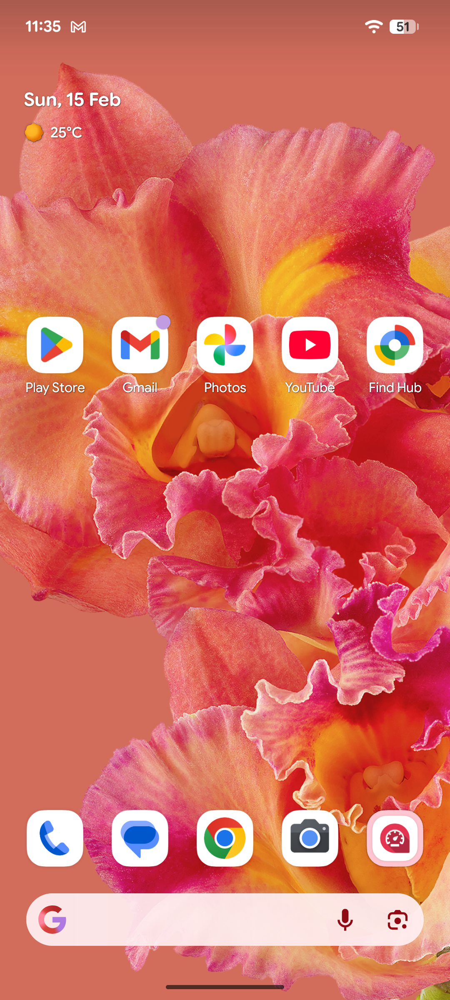
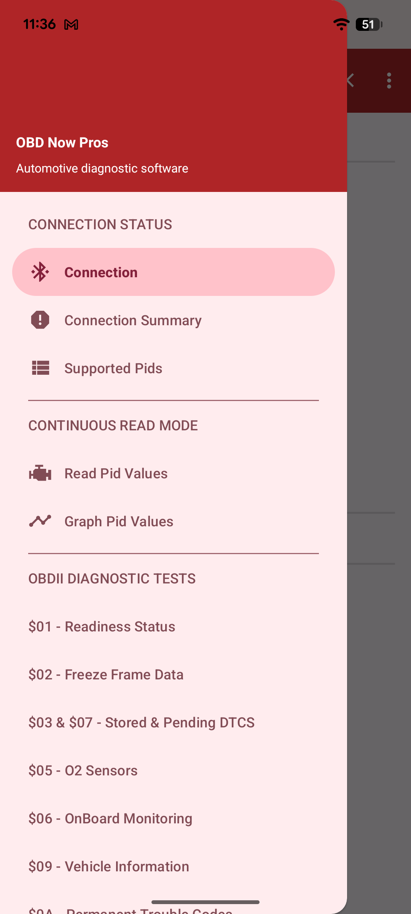
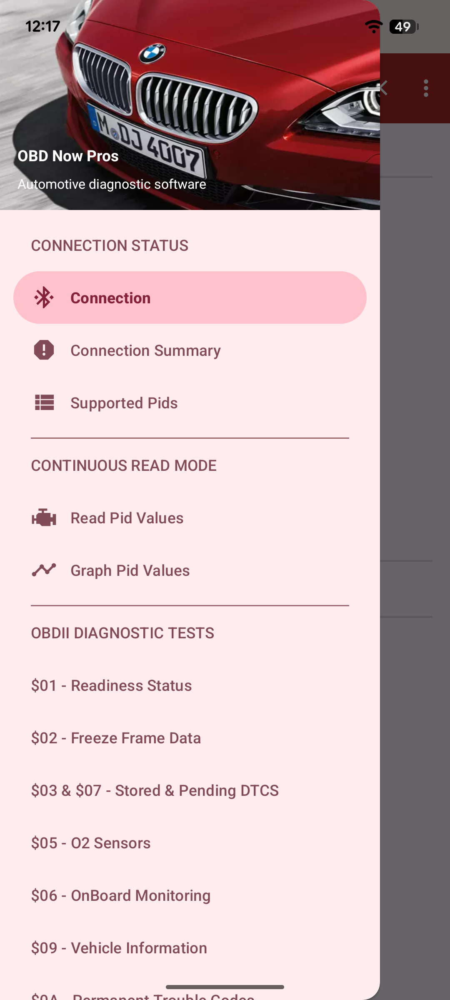
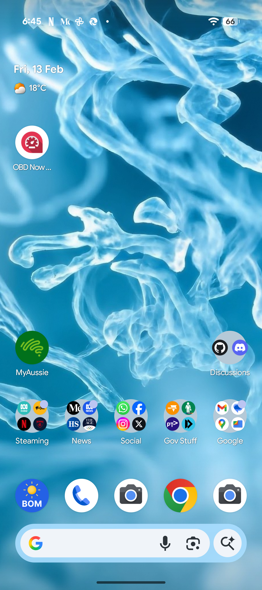
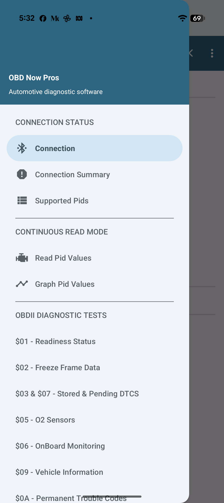
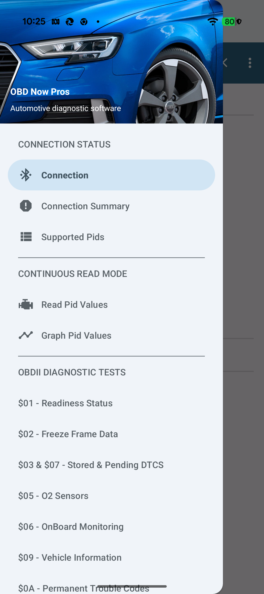
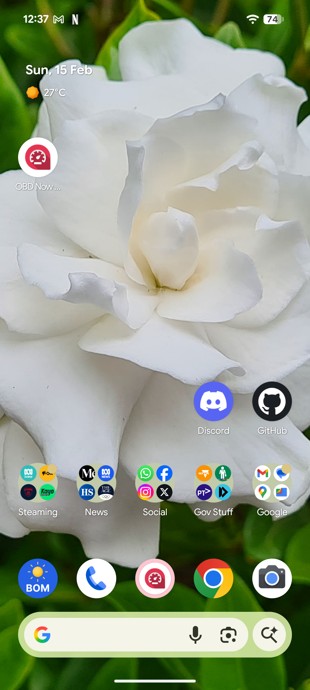
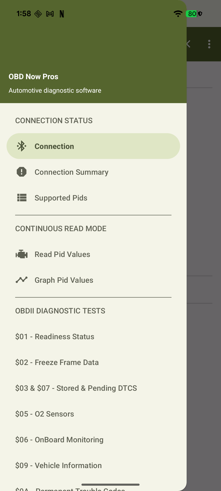
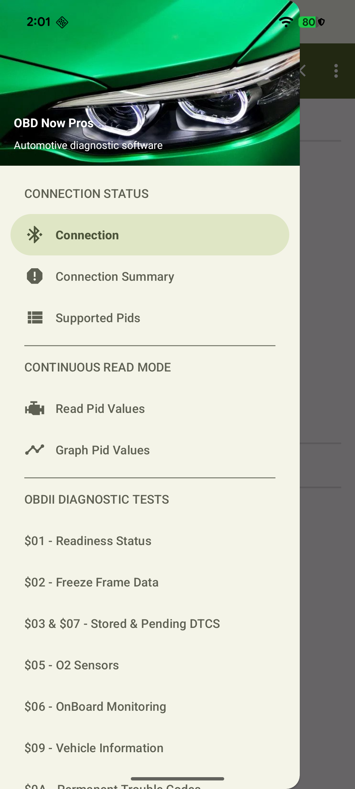

**01/03/2026**

Build 1.0 Creating a new repo. NavigationGraph11Net10

1. Need to modify AboutDialogFragment to have the same Android36.1 features as OBDNowPros's AboutDialogFragment. 

2. Also need to import (into this readme) the three sets of images from OBDNowPro's Help file showing the use of Dynamic Color Themes with a chosen wallpaper along side 
the two versions of the NavigtionView showing either the Dynamic Color Theme with a color background for the NavigationView using the 
BaseActivity's ApplyDynamicHeaderBackground() or our standard NavigationView using the vehicle image in the Resource.Id.nav_header_root. 
Refer to the two new preferences *Use Dynamic Colour Theme* and *Retain Vehicle images while using Dynamic Color Scheme*. 
Might as well just take the text description from the Help file.  

<!-- Red BMW -->
<table cellpadding="6">
  <tr>
    <td></td>
    <td></td>
    <td></td>
  </tr>
</table>

<!-- Blue Audi -->
<table>
  <tr>
    <td></td>
    <td></td>
    <td></td>
  </tr>
</table>

<!-- Green BMW -->
<table>
  <tr>
    <td></td>
    <td></td>
    <td></td>
  </tr>
</table>

Need to replace the above images with the ones from this app. Don't wont to show OBDNowPros names. Should be Android Navigator and How to navigate